# spring-boot-data-jpa-geli-test
technologi stack:
- database sqlite
- cache (ehcache) for cart purpose
- jpa persistent with JPQL
- MVC design with router class
- using TransactionalPayment class with synchronized methode to make sure, deduct stock not enter in race condition

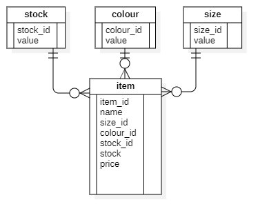
 has 4 table :
- stock, this is stock category
- colour, for colour varian category
- size, for size varian category
- item, it transaction data

url path
- localhost:8080/geli/ControllerGeli/getItem?page=0&size=5 
   for get all item
  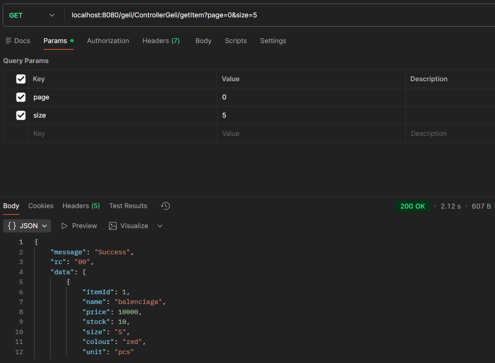
- localhost:8080/geli/ControllerGeli/getItemById?itemId=4
   for get item by id
  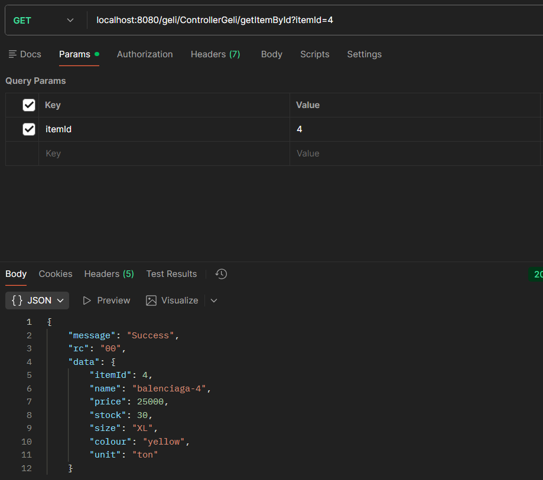
- localhost:8080/geli/ControllerGeli/getColour?page=0&size=5
   for get all colour
  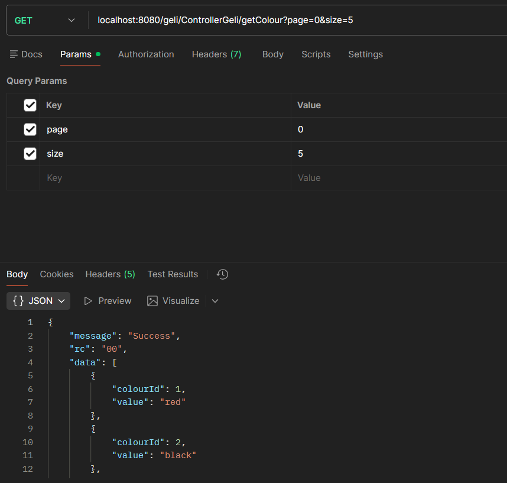
- localhost:8080/geli/ControllerGeli/getColourById?colourId=4
   for get all colour
  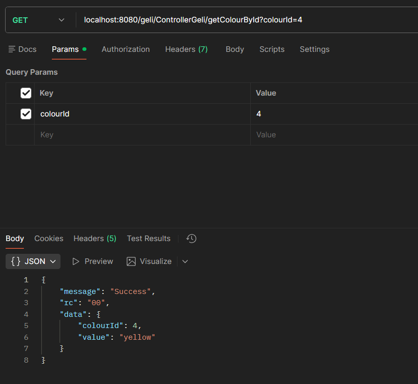
- localhost:8080/geli/ControllerGeli/getSize?page=0&size=2
   for get all size
  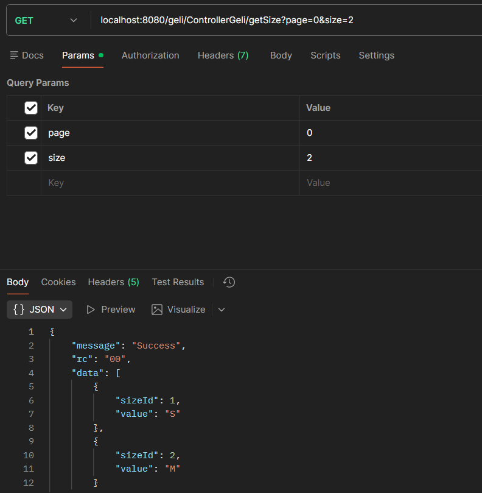
- localhost:8080/geli/ControllerGeli/getCart
   for get all cart
  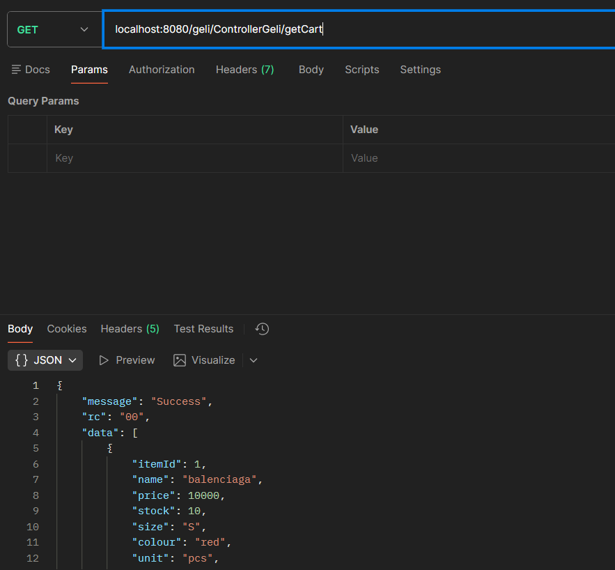
- localhost:8080/geli/ControllerGeli/getSizeById?sizeId=5
   for get size by id
  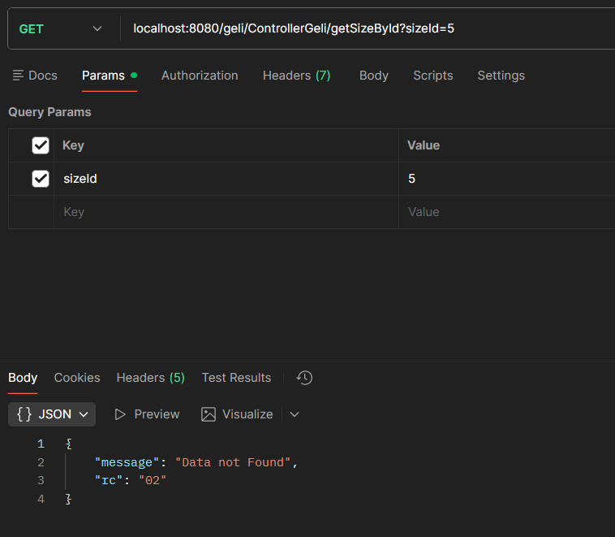 
- localhost:8080/geli/ControllerGeli/getStock?page=0&size=5
   for get all stock
  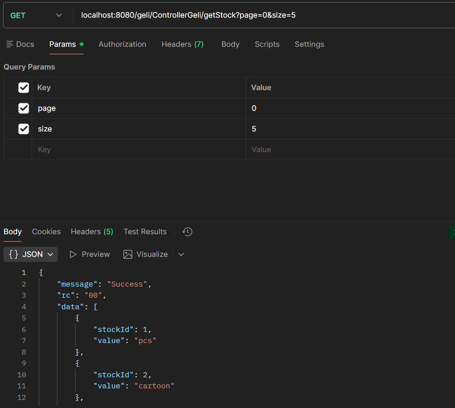
- localhost:8080/geli/ControllerGeli/getStockById?stockId=5
   for get all stock by id
  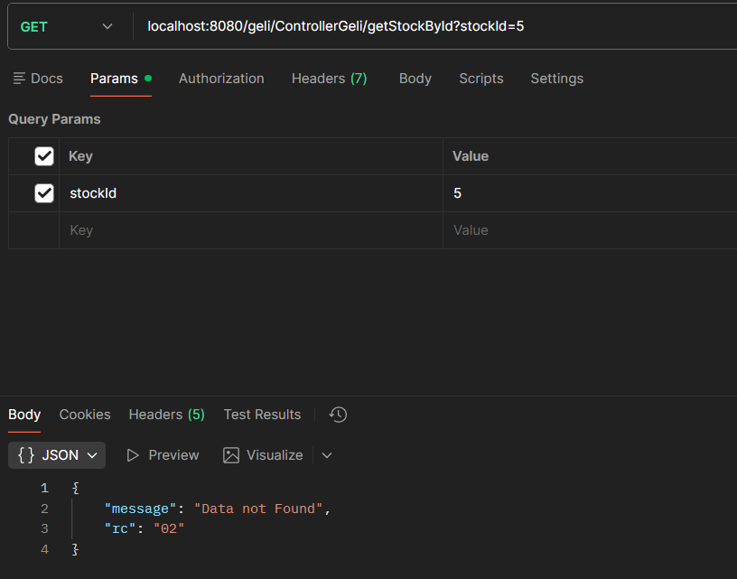
- localhost:8080/geli/ControllerGeli/createItem
   for create new item
  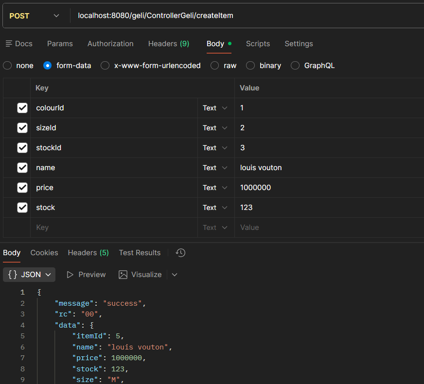
- localhost:8080/geli/ControllerGeli/deleteItem
   for delete item
- localhost:8080/geli/ControllerGeli/deleteColour
   for delete colour category
- localhost:8080/geli/ControllerGeli/deleteSize
   for delete size category
- localhost:8080/geli/ControllerGeli/updateItem
   for update item
- localhost:8080/geli/ControllerGeli/createColour
   for update item
- localhost:8080/geli/ControllerGeli/createSize
   for create size category
- localhost:8080/geli/ControllerGeli/addCart
   for add cart
- localhost:8080/geli/ControllerGeli/payCart
   for payment cart

how to configure
- make sure workdir on application.properties is set with jar file path
- change http.port if needed

how to compile
- run command "mvn clean package"
- result on folder target with name GELI-TEST-1.0-SNAPSHOT.jar

how to run
- java -jar GELI-TEST-1.0-SNAPSHOT.jar

note: i add postman script (Collection 2.1 export version) for testing purpose, file name is "GELI TEST.postman_collection.json"